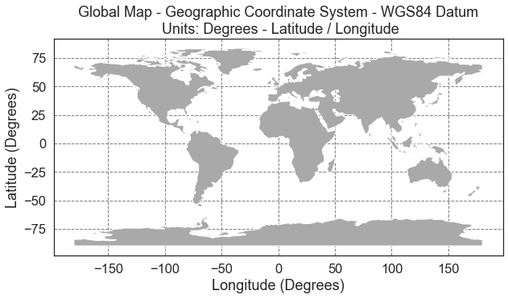
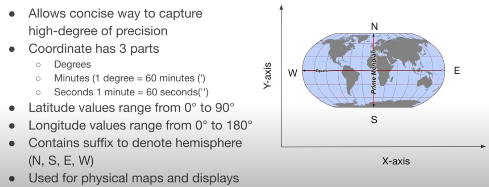
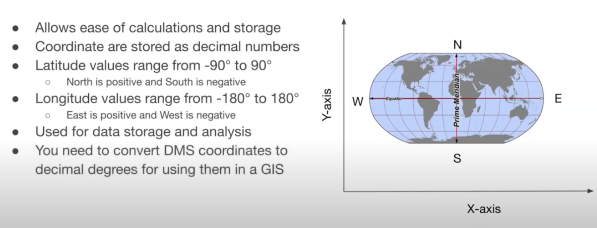
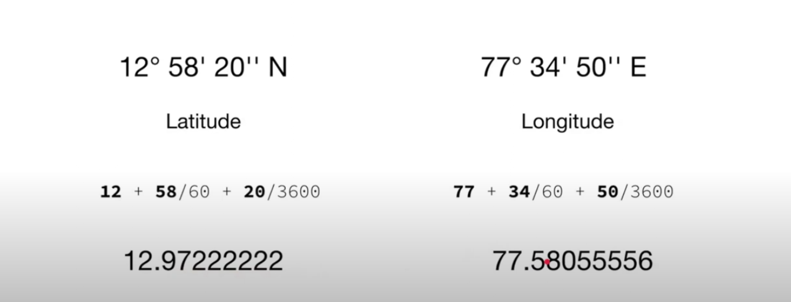

# Spatial Analysis Course
## About
Learning Python for Data Analysis and use it with Biker's Buddy.

## Requirements
1. Pyenv
2. Python 3.12.6
3. 

## Dependency Management
- Poetry

## Reference
1. [Course Path](https://courses.spatialthoughts.com/python-foundation.html)
2. [Video Lectures](https://www.youtube.com/playlist?list=PLppGmFLhQ1HJspXSA0asH9kw1OhlLrxHT)
3. [Auxiliar material for CRS](https://www.earthdatascience.org/courses/use-data-open-source-python/intro-vector-data-python/spatial-data-vector-shapefiles/geographic-vs-projected-coordinate-reference-systems-python/)
4. https://docs.python.org/3/library/index.html (Remember to check by the version you are using)

## Video Log
1. [Class 1](https://www.youtube.com/watch?v=rHgsslH-_y0&list=PLppGmFLhQ1HJspXSA0asH9kw1OhlLrxHT&index=1) - OK
2. [Class 2](https://www.youtube.com/watch?v=2c-KWy9K5x4&list=PLppGmFLhQ1HJspXSA0asH9kw1OhlLrxHT&index=2) - OK
3. [Class 3](https://www.youtube.com/watch?v=xsId8Yt-S-Y&list=PLppGmFLhQ1HJspXSA0asH9kw1OhlLrxHT&index=3) - OK
4. [Class 4](https://www.youtube.com/watch?v=JPZOxlOLTKU&list=PLppGmFLhQ1HJspXSA0asH9kw1OhlLrxHT&index=4) - OK
5. [Class 5](https://www.youtube.com/watch?v=DMwiMEQRK34&list=PLppGmFLhQ1HJspXSA0asH9kw1OhlLrxHT&index=5) - OK
6. [Class 6](https://www.youtube.com/watch?v=BxKrHhGAodY&list=PLppGmFLhQ1HJspXSA0asH9kw1OhlLrxHT&index=6) - OK
7. [Class 7](https://www.youtube.com/watch?v=5Dup7260KWI&list=PLppGmFLhQ1HJspXSA0asH9kw1OhlLrxHT&index=7) - OK
8. [Class 8](https://www.youtube.com/watch?v=RNp5sF-ZEkM&list=PLppGmFLhQ1HJspXSA0asH9kw1OhlLrxHT&index=8) - OK
9. [Class 9](https://www.youtube.com/watch?v=NkKuzVkYOzk&list=PLppGmFLhQ1HJspXSA0asH9kw1OhlLrxHT&index=10) - OK
10. [Class 10](https://www.youtube.com/watch?v=rcO29Q5Nd3Y&list=PLppGmFLhQ1HJspXSA0asH9kw1OhlLrxHT&index=12) - OK
11. [Class 11](https://www.youtube.com/watch?v=kgY2npOQFM8&list=PLppGmFLhQ1HJspXSA0asH9kw1OhlLrxHT&index=14) - OK
12. [Class 12](https://www.youtube.com/watch?v=BqBPWQt9PL0&list=PLppGmFLhQ1HJspXSA0asH9kw1OhlLrxHT&index=16)

## Notes
### Coordinates Formats and precision
- X and Y coordinates help us uniquely identify a place on earth
- 2 main types of Coordinate Reference Systems(CRS):
  - *Geographic CRS*: Uses latitude and longitude as coordinates on a spherical/ellipsoidal model of the earth.
  - *Projected CRS*: Uses X and Y coordinates on a planar projected surface

### Geographic CRS
A geographic CRS uses a grid that wraps around the entire globe. This means that each point on the globe is defined using the SAME coordinate system and the same units as defined within that particular geographic CRS. Geographic coordinate reference systems are best for global analysis however it is important to remember that distance is distorted using a geographic lat / long CRS.

The geographic WGS84 lat/long CRS has an origin - (0,0) - located at the intersection of the Equator (0° latitude) and Prime Meridian (0° longitude) on the globe.

### Projected CRS
Spatial projection refers to the mathematical calculations performed to flatten the 3D data onto a 2D plane (your computer screen or a paper map). Projecting data from a round surface onto a flat surface, results in visual modifications to the data when plotted on a map. Some areas are stretched and some are compressed. You can see this distortion when you look at a map of the entire globe.

The mathematical calculations used in spatial projections are designed to optimize the relative size and shape of a particular region on the globe.

### Commonly formats used to store coordinates
* Degrees, Minutes and Seconds

* Decimal Degrees

### Modelling Earth's surface
#### Sphere
We can assume Earth is a perfect sphere with a Radius of ~6371Km. it *greatly simplfies calculations*

#### Ellpsoid (Spheroid)
This true shape of earth is closer to this model.
Its definition has a semi-major and semi-minor axis. The most accurate and used ellipsoid is **WGS84 ellipsoid** which has the parameters below:
1. Semi-major axis of ~6378.137 Km
2. Semi-minor axis of ~6356.752 Km

### Haversine Distance:
The Haversine Formula calculates the straight-line distance in meters, assuming that Earth is a sphere.

## Tips
An easy and simple way to remove duplicates from a list is to convert it to a set.

